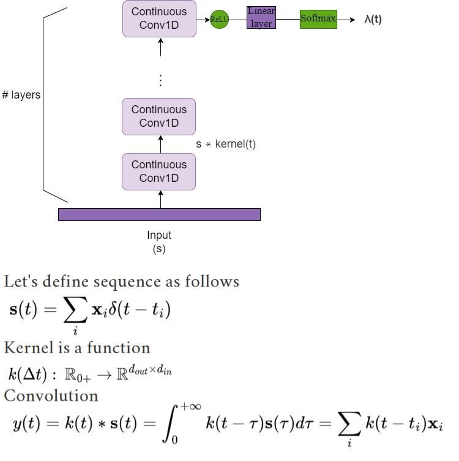
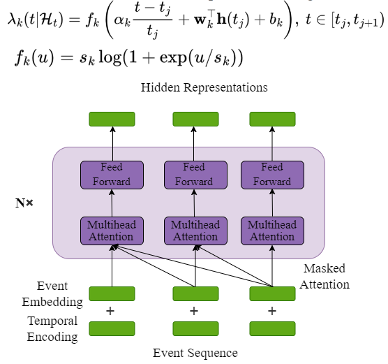

<div align="center">


# COTIC

<a href="https://pytorch.org/get-started/locally/"></a>
<a href="https://pytorchlightning.ai/"></a>
<a href="https://hydra.cc/"></a>
<a href="https://github.com/ashleve/lightning-hydra-template"></a><br>

</div>

## Description

In this project, the problem of return time prediction
and event time prediction is considered. To solve this problem, 
four models were considered: Continuous Time CNN, Transformer Hawkes, WaveNet and 
WaveNet with intensity interpolation. 
Here is a convenient pipeline for working with them and 
launching them. To get acquainted with the structure of 
the code and the features, you can look at the 
information provided below.


## Architecture of model

* Continuous time CNN

 
* Transformer Hawkes


	
	

## Datasets

* LinkedIn
* Amazon
* IPTV
* Synthetic Hawkes processes

The datasets are taken from [cloud drive](https://drive.google.com/drive/folders/1vxNhcbgHvq9CfW9-RhTZ2yTovFQ5F4XD?usp=drive_link).


## How to run

Install dependencies

```bash
# clone project
git clone git@github.com:VladislavZh/CCNN.git
cd CCNN

# [OPTIONAL] create conda environment
conda create -n myenv python=3.9
conda activate myenv

# install pytorch according to instructions
# https://pytorch.org/get-started/

# install requirements
pip install -r requirements.txt
```

Train model with default configuration

```bash
# train on CPU
python train.py trainer.gpus=0

# train on GPU
python train.py trainer.gpus=1
```

Train different model architectures with comet logger:

Change api_key, project_name, workspace in [configs/logger/comet.yaml](configs/logger/comet.yaml) 

```bash
python train.py --config-name=train.yaml data_dir=/content/data_utils/ model.net.num_types=count_of_event_type
```

*data_dir* should be a folder with csv files where each file represent a sequence with event and timestamp.
<br>
*--config-name* one of model from [configs/](configs/)

You can override any parameter from command line like this

```bash
python train.py trainer.max_epochs=20 datamodule.batch_size=64
```

<br>

## Project Structure

The directory structure of new project looks like this:

```
├── configs                   <- Hydra configuration files
│   ├── callbacks                <- Callbacks configs
│   ├── datamodule               <- Datamodule configs
│   ├── debug                    <- Debugging configs
│   ├── experiment               <- Experiment configs
│   ├── hparams_search           <- Hyperparameter search configs
│   ├── local                    <- Local configs
│   ├── log_dir                  <- Logging directory configs
│   ├── logger                   <- Logger configs
│   ├── model                    <- Model configs
│   ├── trainer                  <- Trainer configs
│         │     
│         ├── test.yaml             <- Main config for testing
│         ├── train.yaml            <- Main config for training
│         ├── ...
├── data                   <- Project data
│
├── logs                   <- Logs generated by Hydra and PyTorch Lightning loggers
│
├── notebooks              <- Jupyter notebooks. Naming convention is a number (for ordering),
│                             the creator's initials, and a short `-` delimited description,
│                             e.g. `1.0-jqp-initial-data-exploration.ipynb`.
│
├── scripts                <- Shell scripts
│
├── src                    <- Source code
│   ├── datamodules              <- Lightning datamodules
│   ├── metrics                  <- Metrics for different model
│   ├── models                   <- Lightning models
│   ├── utils                    <- Utility scripts
│   ├── vendor                   <- Third party code that cannot be installed using PIP/Conda
│   │
│   ├── testing_pipeline.py
│   └── training_pipeline.py
│
├── tests                  <- Tests of any kind
│   ├── helpers                  <- A couple of testing utilities
│   ├── shell                    <- Shell/command based tests
│   └── unit                     <- Unit tests
│
├── test.py               <- Run testing
├── train.py              <- Run training
│
├── .env.example              <- Template of the file for storing private environment variables
├── .gitignore                <- List of files/folders ignored by git
├── .pre-commit-config.yaml   <- Configuration of pre-commit hooks for code formatting
├── requirements.txt          <- File for installing python dependencies
├── setup.cfg                 <- Configuration of linters and pytest
└── README.md
```

<br>

 ## References

- [The Neural Hawkes Process: A Neurally
Self-Modulating Multivariate Point Process](https://arxiv.org/pdf/1612.09328.pdf)
- [Continuous Cnn For Nonuniform Time Series](https://ieeexplore.ieee.org/document/9414318)
