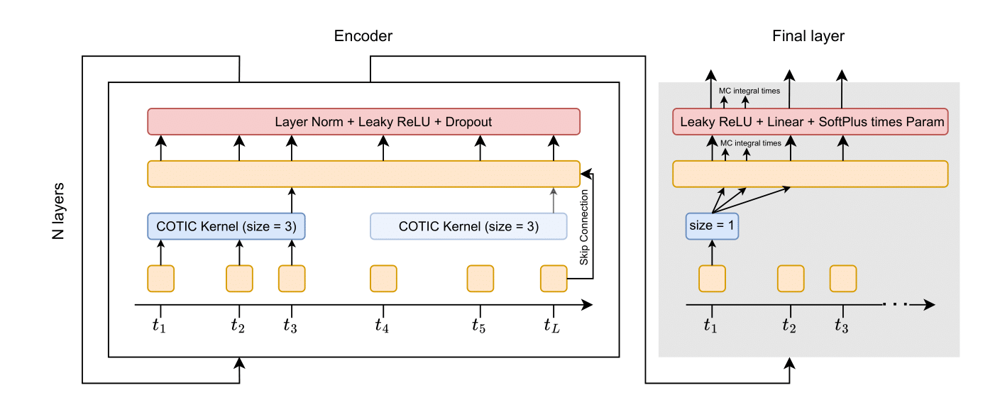

<div align="center">


# COTIC

<a href="https://pytorch.org/get-started/locally/"></a>
<a href="https://pytorchlightning.ai/"></a>
<a href="https://hydra.cc/"></a>
<a href="https://github.com/ashleve/lightning-hydra-template"></a><br>

</div>

## Description

In this project, the problem of return time prediction
and event type prediction is considered. To solve this problem, 
we suggest a continuous time convolution model (COTIC).


## Architecture of model

* COTIC


	
	

## Datasets

* Retweet
* Amazon
* SO
* Transactions
* Mimic
* LinkedIn
* MemeTrack

The datasets are taken from [cloud drive](https://drive.google.com/drive/folders/1vxNhcbgHvq9CfW9-RhTZ2yTovFQ5F4XD?usp=drive_link).


## How to run

Install dependencies

```bash
# clone project
git clone git@github.com:VladislavZh/COTIC.git
cd COTIC

python -m venv .venv
source .venv/bin/activate

# install pytorch according to instructions
# https://pytorch.org/get-started/

# install requirements
pip install -r requirements.txt
```

Train model with default configuration

```bash
# train on CPU
python train.py name=[name] dataset=[dataset] num_types=[num_types]

# train on GPU
python train.py trainer=gpu name=[name] dataset=[dataset] num_types=[num_types]
```

Data path should as follows: `data/[dataset]/[train/val/test]` with csv sequence files.

You can override any parameter from command line like this

```bash
python train.py name=[name] dataset=[dataset] num_types=[num_types] trainer.max_epochs=20 datamodule.batch_size=64
```


## Project Structure

The directory structure of new project looks like this:

```
├── configs                   <- Hydra configuration files
│   ├── callbacks                <- Callbacks configs
│   ├── datamodule               <- Datamodule configs
│   ├── debug                    <- Debugging configs
│   ├── experiment               <- Experiment configs
│   ├── hparams_search           <- Hyperparameter search configs
│   ├── local                    <- Local configs
│   ├── log_dir                  <- Logging directory configs
│   ├── logger                   <- Logger configs
│   ├── model                    <- Model configs
│   ├── trainer                  <- Trainer configs
│         │     
│         ├── test.yaml             <- Main config for testing
│         ├── train.yaml            <- Main config for training
│         ├── ...
├── data                   <- Project data
│
├── logs                   <- Logs generated by Hydra and PyTorch Lightning loggers
│
├── src                    <- Source code
│   ├── datamodules              <- Lightning datamodules
│   ├── models                   <- Lightning models
│   ├── utils                    <- Utility scripts
│   │
│   ├── testing_pipeline.py
│   └── training_pipeline.py
│
├── tests                  <- Tests of any kind
│   ├── helpers                  <- A couple of testing utilities
│   ├── shell                    <- Shell/command based tests
│   └── unit                     <- Unit tests
│
├── test.py               <- Run testing
├── train.py              <- Run training
│
├── .env.example              <- Template of the file for storing private environment variables
├── .gitignore                <- List of files/folders ignored by git
├── .pre-commit-config.yaml   <- Configuration of pre-commit hooks for code formatting
├── requirements.txt          <- File for installing python dependencies
├── setup.cfg                 <- Configuration of linters and pytest
└── README.md
```

